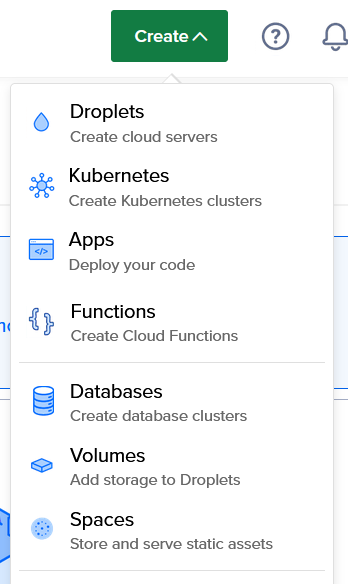
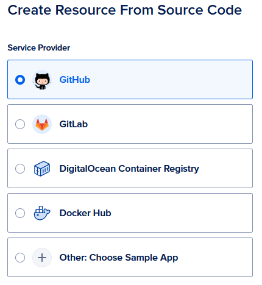
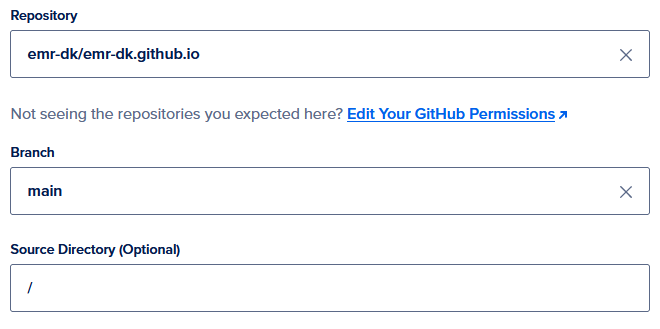
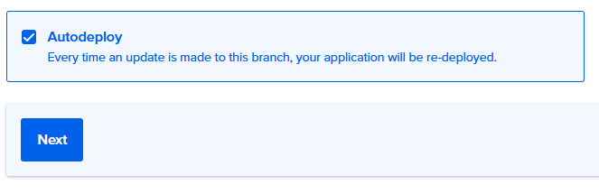
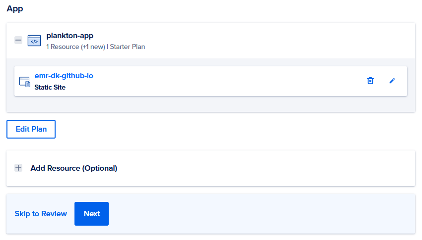

# Hugo på DigitalOcean
Hvis du gerne vil læse lidt om mine overvejelser vedrørende setuppet af denne side kan du finde det [her](blog/3-en-hugo-site).

Min side er sat sådan op at alt arbejde arbejde jeg laver foregår lokalt på min egen computer. Jeg tester alt på en Ubuntu maskine der kører gennem WSL2 på en Windows computer. Jeg er positivt overrasket over hvor godt det fungerer - særligt i forhold til at dual-boote to styresystemer på én computer. 
Jeg udarbejder rettelser og nye blog posts på min maskine og pusher dem så til Github, hvorfra DigitalOcean så ombygger min Hugo site når den ser ændringer i et designeret repositorie. En fordel ved denne model er at man har et par gratis hosts af statiske websider gennem digital ocean, hvilket udover at være gratis også har den fordel at man ikke skal vedligeholde en cloud maskine.

## Hvad skal du bruge?
* En WSL2 Ubuntu installation på din Windows maskine, eller en Ubuntu installation

Resten klarer vi undervejs

## Lav en lokal git
Først installeres git: 
    
    sudo apt-get update
    sudo apt-get install git-all

Så Hugo

    sudo apt-get install hugo

Når det er klaret kan hugo projektet oprettes ved at gøre følgende: 

	hugo new site <navn>
 
Den mappe der bliver oprettet her, er der hvor projektet vil leve. Gå derfor ind i mappen og gør følgende:

    cd <navn>
    git init
    git add .
    git commit -m "Første commit"

Nu skal du så oprette et repositorie på Github for at komme videre.

## Koblingen til Github
For at kunne køre hele processen fra commandline installerer vi githubs cli værktøj. Dette er bare tyvstjålet fra den [officielle vejledning](https://github.com/cli/cli/blob/trunk/docs/install_linux.md)

    type -p curl >/dev/null || sudo apt install curl -y
    curl -fsSL https://cli.github.com/packages/githubcli-archive-keyring.gpg | sudo dd of=/usr/share/keyrings/githubcli-archive-keyring.gpg \
    && sudo chmod go+r /usr/share/keyrings/githubcli-archive-keyring.gpg \
    && echo "deb [arch=$(dpkg --print-architecture) signed-by=/usr/share/keyrings/githubcli-archive-keyring.gpg] https://cli.github.com/packages stable main" | sudo tee /etc/apt/sources.list.d/github-cli.list > /dev/null \
    && sudo apt update \
    && sudo apt install gh -y

Når det er klaret kan vi manipulere direkte med vores Github fra terminalen. Så vi opretter det tidligere omtalte repo sådan her

    gh repo create

Dette giver en fin interaktiv vejledning som er nem nok at følge med i, dog skal du huske at vælge _Push an existing local repository to Github_, samt at sige _Yes_ når der spørges om _Add a remote_

Sidst i din terminal fortæller den også at den her _pushed commits to <url til nyoprettede git>_. Altså er der nu en kobling mellem din lokale git og den du finder på Github.

 ## Skal du bruge et theme
 Én af de ting der fik mig til at bruge Hugo var nemheden i at tilføje et nyt tema - samt at jeg fandt en del jeg synes var mega fede. Hvis du, som mig, også er interesseret i dette kan du finde en lang, lang række temaer [her](https://themes.gohugo.io/). 
 
 For mig havde jeg en lang række udfordringer ved at clone et repo som theme men, at det virkede uden problemer som submodule. Så det gør vi.
 
 Hvis du befinder dig i dit projekts grundfolder kan du gøre følgende:

    git submodule add <repo .git> 

Og når du så skal opdatere det en gang i fremtiden kan du bare lave et pull

    git submodule update

Jeg har selv clonet det theme jeg bruger, og foretaget rettelser i det. Derefter har jeg pushet de rettelser til min Github konto og bruger så dette som et submodule. 

Dit projekt vil altså se nogenlunde sådan her ud

    projekt_dir
    └───.git
    └───archetypes
    └───archetypes
    └───content
    └───data
    └───layouts
    └───public
    └───resources
    └───static
    └───themes
    │   └───<theme submodule>
    │config.toml
    │README.md

## Opsætning på DigitalOcean
Så er det om at komme i gang på DigitalOcean. Opret en konto og evt. et projekt og så kan vi komme i gang.

Lav en DigitalOcean app

 

Vælg Github som kilde til din applikation

 

Når du skal vælge et repositorie som udgangspunkt for din applikation skal det selvfølgelig være den du lavede ovenfor. Derudover vil DigitalOcean bedeo mat få rettighed til at tilgå dit repositorie. Du kan vælge om DO skal have adgang til alle eller bare det ene repo. 

 Det er muligt at levere appen fra en undermappe i repositoriet men appen vil som udgangspunkt ligge i /

 

Du kan vælge om appen skal auto deployes når github opdateres eller om det skal gøres manuelt

 

Næste side giver en kort beskrivelse af hvad din app kommer til at hedde (hvilket her kan ændres fx). 
Der er flere trin der kan gennemgåes men tryk evt. bare _Skip to review_ medmindre du gerne vil detailstyre appen. 

 

På reviewsiden kommer en endelig mulighed for at se alle de ting du har valgt, hvis der ikke er noget der skal ændres kan du trykke på:

 

## Vigtige indstillinger
Efter du har fået tildelt et applikationsnavn fra DigitalOcean skal du ind i din config.toml fil og i headeren sætte 

    baseURL = "<DigitalOcean_url>"

Nu skulle du gerne være klar og kunne finde appen på selv samme URL.

### Kilder

https://github.com/cli/cli/blob/trunk/docs/install_linux.md
https://www.djpeacher.com/posts/quick-hugo-deploy-with-github-actions/